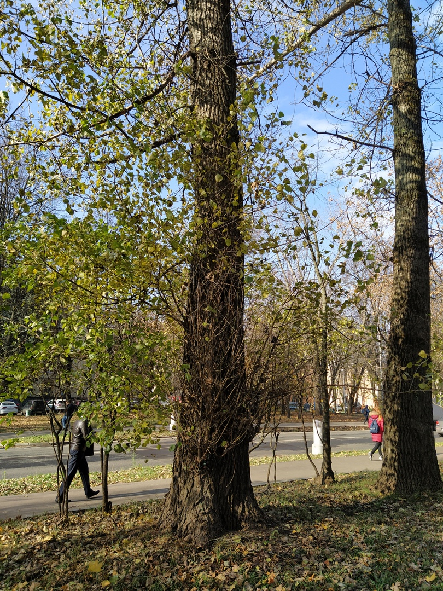
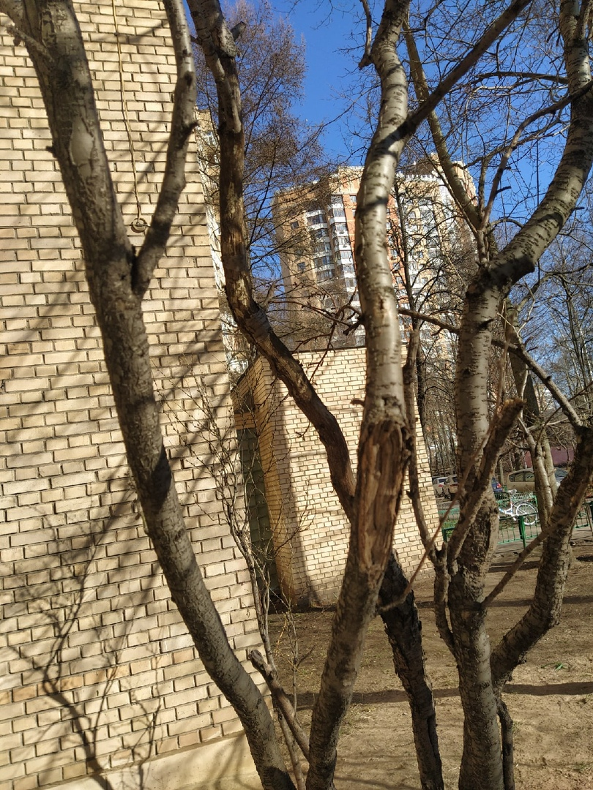
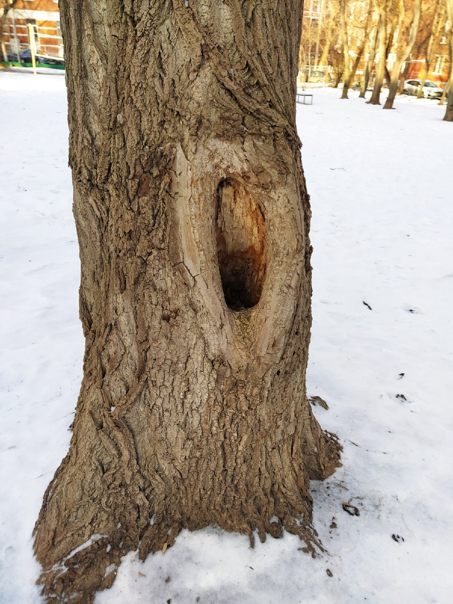
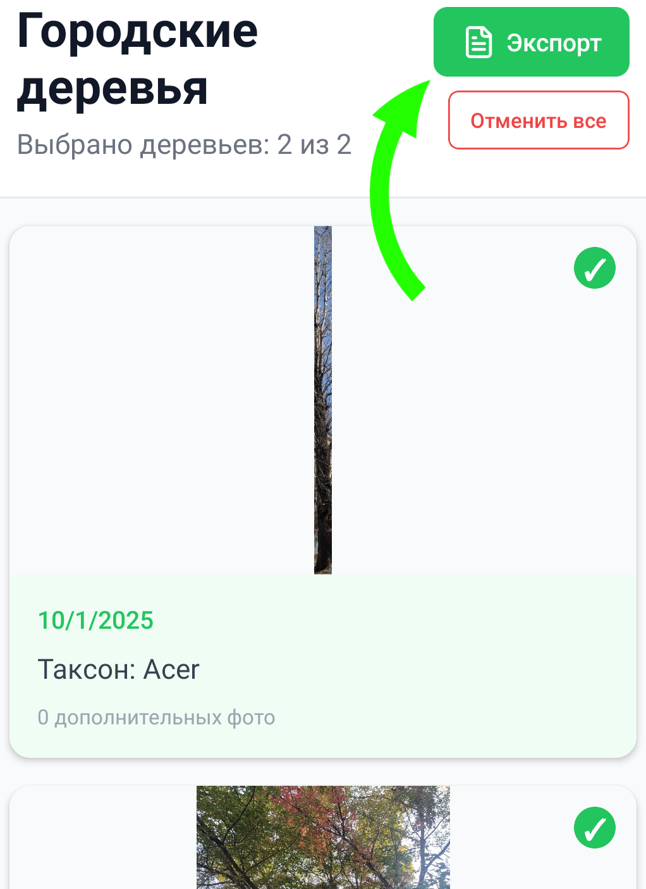

# Инструкция по использованию

Полное руководство по работе с приложением "Городские деревья"

## 📷 Добавление растения

Сфотографируйте дерево или несколько деревьев общим планом. Если деревьев несколько, то выберите такой ракурс, чтобы они не перегораживали друг друга.

### Пример хорошего ракурса:

### Пример плохого ракурса:

Дождитесь распознавания деревьев детектором и выберите те, которые вы хотите добавить в базу данных для дальнейшего анализа. Этот шаг работает без интернета.

Если у дерева могут быть повреждения, которые плохо видно с общего плана, то вы можете перейти в карточку конкретного дерева и добавить дополнительные фото вблизи. Постарайтесь сделать снимок так, чтобы рядом стоящие деревья не попали в кадр.

### Пример хорошего доп. фото:

## ✨ Генерация описания

Когда устройство подключено к интернету, вы можете запустить анализ искусственным интеллектом, который произведет классификацию вида растения и обнаружит дефекты (трещина, дупло, гниль, язва). Для этого перейдите в карточку дерева и нажмите на кнопку Обработать ИИ.

## 📄 Формирование отчета

Для формирования отчета перейдите на главный экран, выберите необходимые растения с помощью чек-боксов и нажмите кнопку Экспорт.

В результате вы получите отчет в формате PDF, который можно изучить или экспортировать.