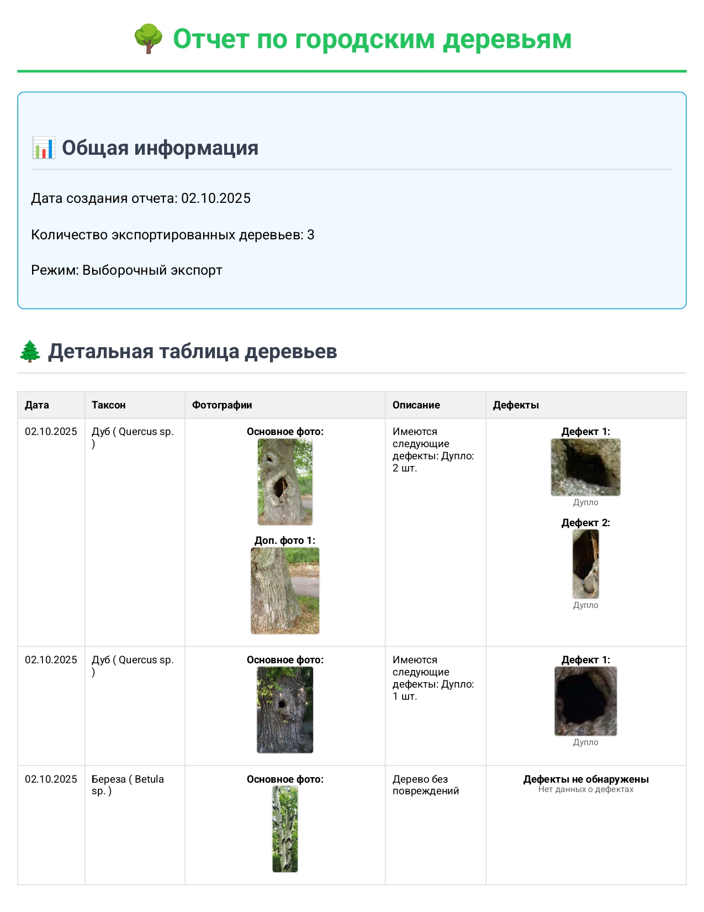

# Android-приложение для определения характеристик состояния зеленых насаждений города по фотографиям

## Как установить мобильное приложение
Скачайте готовый apk-файл [ai-dendrolog-silk-road.apk](https://disk.yandex.ru/d/Wa0jW8RNL9MSlQ) на мобильный телефон, запустите и следуйте инструкциям по установке.

## Пример отчета, сгенерированного в приложении



## Демонстрация приложения

https://github.com/user-attachments/assets/70acccb1-31d5-476f-9f36-326a8ceeb267

## Как собрать apk-файл из исходного кода
1. Склонируйте репозиторий
2. Выполните команды:
```
npx expo prebuild --platform android
cd android/
./gradlew clean
./gradlew assembleRelease
```
3. Дождитесь генерации, файл будет доступен по пути `android/app/build/outputs/apk/release/app-release.apk`.

## Структура кодовой базы
- `app/` - основные экраны приложения (React Native/Expo)
- `utils/` - утилиты для работы с ИИ-моделями (YOLO, классификация деревьев)
- `assets/` - модели машинного обучения (.onnx) и изображения
- `android/` - нативная Android-часть проекта
- `database/` - работа с базой данных деревьев
